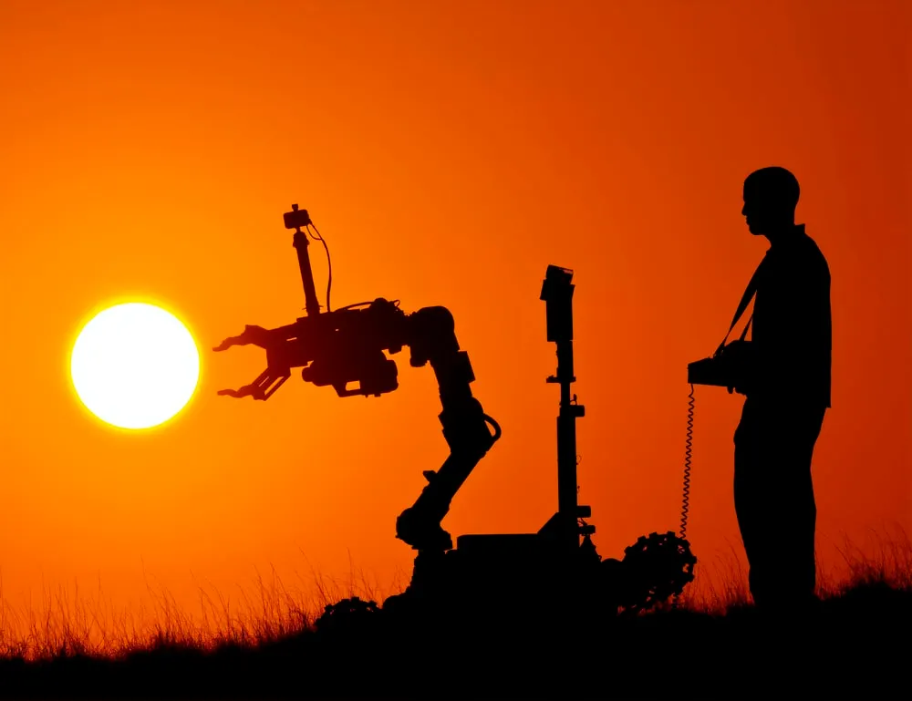
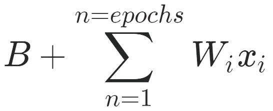
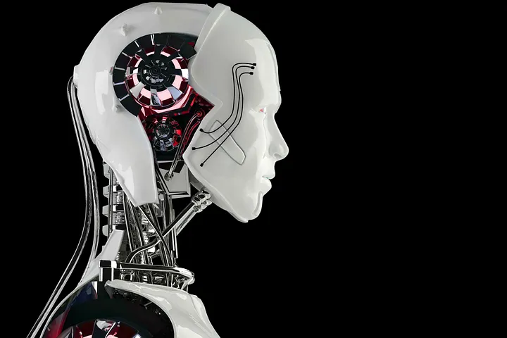

When it comes to AI or robotics, the common public reaction is perceivable. When they talk about global domination by robots or job loss due to advances in robotics, their assumptions are highly based on science fiction and not that much on reality. In fact, robotics is an indistinguishable part of our lives and essential to us in a controlled manner. Whether you are strongly against anything related to robotics or are a lead engineer at [Boston Dynamics](https://bostondynamics.com/), it is indisputable that robotics is in our everyday lives.
 

Everything from a toaster, to your computer, there is some form of robotics in it. For example, while you are browsing on Amazon and it suggests you exactly what you are looking for, you witnessed AI. AI has just helped you and Amazon. After introducing this AI, Amazon saw a 29% increase in sales and $12.83 billion more dollars in revenue. This shows that AI is helping customers like you and companies like Amazon earn money. In fact, our lives are also at the hands of AI. Boeing and other companies are creating more efficient airplane air-frames using AI. They have trained the AI to take their requirements and it will design the most perfect air-frame.

According to Boeing, their new Boeing 777 will be 100% computer generated and assembled online before they even bring out the materials! In fact, the computer will even create a special mixture of metals and composites to make the air-frame lighter! Look around, every item near you is probably manufactured in a factory. In the year 2020 alone, 1.64 million industrial robots are used in factories around the globe and analytics say that they will replace 20 million factory jobs by 2030! This raises the concern that our interdependence might lead to severe problems depicted by literature.

The ethical aspect of AI has been an extremely controversial topic. There is great hope that AI can personalize school learning plans, help disabled people, and revolutionize our lives, but there must be a balance. At a deeper level, AI is just a math equation that runs behind it but its ability to gradually learn is one fact that concerns many.

Though, if AI can be used conservatively and concisely, the severity of the consequence may be minimal. That raises a question though; as human beings, we are very curious, and we will strive to learn more and eventually lead to problems much greater than our imagination. But how severe is severe?

That rhetorical question has quite a simple answer. AI is being developed in individual parts like some work on vision while others work on speech. Other engineers work on the robotic humanoid part. When a person gets the idea of combining all the parts, he/she will make a close replica of a human, and if not given the right knowledge of ethics and society, the robot will believe that it is one of us. As humans are quite violent, in the sense that we are always fighting each other, the robots will do the same. Many people discriminate, the robots will do the same. They will be our replica only made of metal and 100 times stronger. This is what we fear and if not controlled, we won’t have to watch movies to fear it.

To conclude, the question is not whether AI is ethical but rather where is the limit. We must learn to live within boundaries and know that exceeding them can have grave consequences. The research our scientists have done is truly incredible but only to a limit. The next time you pull out a mobile phone or any other device, remember our interdependence with it and its similarity to any other robot or AI.
