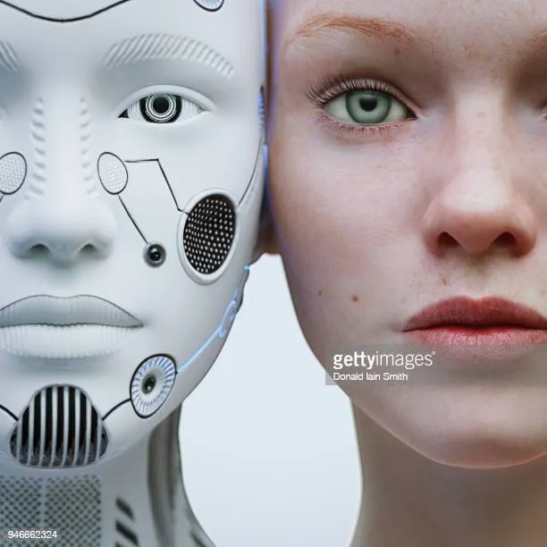
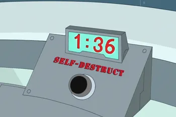

We have all heard of or even discussed ethics before. Some may have even heard of a new field of philosophy called “AI Ethics.” But what is it really?

## AI Ethics

This emerging field of philosophy deals with the primary question *“If a person made a sentient machine or program, would shutting the program down or turning off the computer be equivalent to killing it?”* Your immediate answer may be *“No, it is just a computer that WE made!”* But let me provide you with a series of questions that provide depth to this problem!

## IQ

IQ is a general measure of multi-spatial thinking. If a robot has the IQ of a dog or cat, can’t we equate it to a dog or cat? But others might say that AI is not really thinking and is simply predicting from a defined set of data. But how do we know what humans or other animals are thinking? Just because we have a larger dataset and more processing power doesn’t mean we are thinking.

## Material Crisis

Another justification to *“pull the plug”* might be to say that the AI is simply a bunch of transistors, plastic, and metal. But how can we consider humans superior to robots? After all, we are made of oxygen, hydrogen, nitrogen, and other elements. Our brain is simply a bunch of electrical signals(sounds familiar?), and our emotions are just specific chemical compounds released during specific events. Computers(frankly technology in general) are just a simple reflection of us and the way we think.

## Ship of Theseus Problem

Imagine you have a boat that is sailing a hundred miles. But, you couldn’t shell out enough shillings for a fancy-pants boat so you went to the dark alley at midnight and bought one from a guy in a hood. So along the way, your boat fell apart piece by piece and you summoned replacement parts to fix it. When it reached its destination, you ended up replacing EVERY single part of it. Is this still the same boat? If so, what if a storm destroyed the entire boat and you built it from scratch so it is identical to the original? Is it still the same boat then?

The scenario here is asking if it is the parts that define an object or the experience the boat went through. This matters because depending on the interpretation you take you could argue that if you turn off the AI, but turn on the exact same version later, you didn’t kill the ai. Now, you may have a completely different opinion about the Material Crisis. Now, it doesn’t matter if you are made of steel or cells, what matters is the experiences you make with it.

## So What?

What sets us(humans made of cells, flesh, and bone) from them(robots made of steel, motors, and a frame)? If there is no major difference setting us apart, then why would killing a sentient robot be justified? And if a robot has consciousness, should we consider it equal to us? After all, humans consider themselves superior to animals in many ways.

## So is there just 1 answer?

No, not really. What if an AI has the potential to be sentient but is still growing? Can we kill that? Just because it isn’t currently sentient doesn’t mean anything. Humans come from a single cell that is not technically sentient. But as the baby develops, it grows the ability to have sentience.

There are 3 frames of view:
 * No life matters and killing anything(human, animal, or robot) is okay.
 * Some life matters(ethnocentric; humans matter but not animals and robots)
 * All life matters and killing is NOT justified.

## Potential Ideas
### Battery
What if we make a sentient AI and then let it run on battery power until it drains and dies. Technically, it lived its maximum lifespan and its “heart stopped beating”. But you, the inventor, had the ability to swap or attach another battery or an external power source. That is equivalent to a doctor giving a heart transplant. Would a doctor deny your transplant, would you?

### Teach Self-Termination Sequence
What if the first thing you taught the AI is to terminate and wipe the OS on user command? That would be the equivalent of a human “committing suicide”. But, didn’t you “pressure” the robot to do it? Just because a hitman kills a person doesn’t mean that the employer(of the hitman) isn’t at fault.

### Soul

Many may argue that a soul sets biological beings apart from robots. But, what is a soul? Who made it? Is it a subconscious state of the brain or a separate entity running our body? Or is a soul just something made up by humans to try to set them apart from everything else?

## Conclusion

Oftentimes, this decision involves religion and personal biases. But, it is crucial to think about these topics as General Intelligence may not be as far as we think, or hope!
