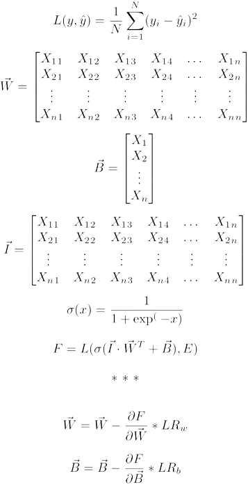
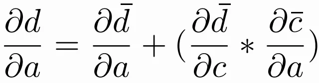
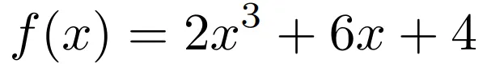

## Introduction

Most people who have worked with TensorFlow have used the Keras API. The Keras API was acquired by Google and added to TensorFlow to simplify Neural Network development by creating an easy and systematic process to train, test, and evaluate neural networks. This is, however, the tip of the iceberg! Stick around until the very end as I open doors to a new, powerful world of custom algorithms, gradients, and losses.

This article will be divided into three distinct sections: Custom Training, Custom Loss, and Custom Forward Passes!

## How we currently use TensorFlow?

Currently, TensorFlow is used as follows: load data, make a Sequential network, select an optimizer and loss function, and train! As simple and convenient as that sounds, it is limited to basic, “off-the-shelf” networks. Here is a basic example from TensorFlow:

```python3
import tensorflow as tf
print("TensorFlow version:", tf.__version__)

mnist = tf.keras.datasets.mnist

(x_train, y_train), (x_test, y_test) = mnist.load_data()
x_train, x_test = x_train / 255.0, x_test / 255.0

model = tf.keras.models.Sequential([
  tf.keras.layers.Flatten(input_shape=(28, 28)),
  tf.keras.layers.Dense(128, activation='relu'),
  tf.keras.layers.Dropout(0.2),
  tf.keras.layers.Dense(10)
])

loss_fn = tf.keras.losses.SparseCategoricalCrossentropy(from_logits=True)

model.compile(optimizer='adam',
              loss=loss_fn,
              metrics=['accuracy'])

model.fit(x_train, y_train, epochs=5)
model.evaluate(x_test,  y_test, verbose=2)
```

As you will see, every component of this program can be tweaked, expanded, and customized!


## Math???

One more thing: We need to learn some basics about TensorFlow mathematics! To understand why this is so significant — arguably the most crucial feature of TensorFlow — you must first understand the basics of multivariate calculus.



Without delving into the inner complexities of the algorithm depicted above, this represents what an average Dense neuron does during forward and backward propagation. One thing to note is that I have depicted gradient descent as a scaled partial derivative. In reality, an optimizer function is used that utilizes momentum and stochastic gradient descent for higher accuracy and faster convergence. This process can be modified in many locations, including the forward pass, loss function, and optimizer to suit the needs of the task at hand.
Custom Training

Despite its convoluted façade, TensorFlow makes this relatively simple. During training, there are three primary steps:

1. Forward pass
2. Calculate loss
3. Calculate/propagate gradients.

Let’s create a simple example:

```python3
epochs = 2
for epoch in range(epochs):
    print("\nStart of epoch %d" % (epoch,))
    for step, (x_batch_train, y_batch_train) in enumerate(train_dataset):
        with tf.GradientTape() as tape:
            logits = model(x_batch_train, training=True)
            loss_value = loss_fn(y_batch_train, logits)

        grads = tape.gradient(loss_value, model.trainable_weights)
        optimizer.apply_gradients(zip(grads, model.trainable_weights))
        if step % 200 == 0:
            print(
                "Training loss (for one batch) at step %d: %.4f"
                % (step, float(loss_value))
            )
            print("Seen so far: %s samples" % ((step + 1) * batch_size))
```

Firstly, we iterate over the number of epochs the algorithm needs to run for. Next, we must iterate over the entire dataset for a single training step. Now to the more important step: GradientTape. This is a way for TensorFlow to watch variables for change and use automatic (reverse mode) differentiation to find the partial derivatives.

## GradientTape

This function watches all `tf.Variable` or TF logits for change (in terms of mathematical operations performed on it. It then creates a graph of all the functions performed on to as such:


It then calculates the partial derivative with respect to each step before it. Finally, we multiply the partials from the nodes of each path and sum all the products from all the paths that lead to the same source. For example, let’s find the ∂d/∂a.



This is a much more powerful and robust approach than simply finding the change `d` with respect to `a` numerically using *numerical (discrete) differentiation*. This is because the latter approach is prone to *divide-by-zero errors*.

Let’s use a simple, practical demo! Let’s try to numerically and automatically differentiate the following function:



Symbolically differentiation (using the power rule), we would derive the following:


To test this, we will evaluate the gradient of this function at the point **(4, 156)**:


Now, let us write a `GradientTape` function with TensorFlow:

```python3
import tensorflow as tf

def f_x(x):
 return 2 * (x ** 3) + 6 * x + 4

with tf.GradientTape() as tape:
  x = tf.constant(4.0)
  tape.watch(x)
  y = f_x(x)

print(tape.gradient(y, x))

====================================

>>> tf.Tensor(102.0, shape=(), dtype=float32)
```

An important thing to consider here is how I was required to add the `tape.watch(x)` method. This is because GradientTape only automatically watches `tf.Variable` and logits from TF NN and TF Losses. You must convert it to a `tf.constant` and manually watch any other variables.

## Loss Function

The next impressive feature TensorFlow provides is the ability to make custom loss functions. While this seems obvious, it cannot be understated. Determining if the neural network is failing or succeeding at its tasks, it serves as a teacher/mentor of the network by influencing the gradients and allowing the correction to propagate through the network. This can be done quite simply:

```python3
@tf.function
def euclidean(y1, y2, T):
    y1 = tf.squeeze(tf.convert_to_tensor(y1, dtype='float32'))
    y2 = tf.squeeze(tf.convert_to_tensor(y2, dtype='float32'))
    dist = tf.sqrt(tf.reduce_sum(tf.square(tf.subtract(y1, y2)), axis=0))
    return tf.square(tf.subtract(dist, T))
```

Simply writing a function and decorating it with the `tf.function` function can be enough to make a powerful TF function. The decorator allows TensorFlow to create graphs (as shown in the GradientTape section) which is necessary to save the model and increase performance.

Another way to write a simple loss function is through the tf.keras.losses.Loss abstract class. While this is a convenient, more robust way to make a loss function, it might have some limitations imposed by the abstract class for standardization.

```python3
class MeanSquaredError(Loss):

  def call(self, y_true, y_pred):
    return tf.reduce_mean(tf.math.square(y_pred - y_true), axis=-1)
```

### How to write a custom loss function?

Making a loss function is more an art than an exact science. It involves the following preliminary steps:

1. Gather all the “metric” requirements you want your neural network to fulfill.
2. Formulate a way to evaluate the metrics numerically.
3. Using direct/inverse relationships, combine these metrics into a single mathematical loss function.

One of the best examples of this strategy is the Contrastive Loss Function used in many modern networks like the Siamese network.


D_w — Distance between points

Y — Truth value (0 = not related; 1 = related)

This loss function is meant to calculate the distance between two tensors for image differentiation. It has two terms: one is responsible for rewarding the algorithm for having points closer together, while the other returns 0 if the points are farther out. This is made more apparent when the 1/2 normalization terms are removed.

## Optimization

This is the final major way to customize your AI adventures. As explained earlier, the backpropagation stage in the **Math???** section was simplified to a linear function with the learning rate scaling the gradient. There are **much** more powerful techniques to get more performant algorithms with faster convergence and higher accuracy.

### Adam
Almost all beginners have heard of the Adam optimizer. It is, after all, the most popular optimizer for a wide variety of DNN tasks. This is the perfect example of a momentum-based optimizer with squared gradients. Firstly, it must square (and then square root) the gradients. This reduces a lot of the oscillation and removes all sense of magnitude from the gradients leaving just the magnitude of the step. Next, it will calculate a running average of the gradients to prevent erratic changes in the concurrent gradients and magnify the gradients if the loss is rapidly converging.

## Conclusion

As I have (hopefully) demonstrated in this article, a vast universe of possibilities fuels modern deep-learning research and development. Whether you use one or more of the techniques listed in this article; whether you use TensorFlow, PyTorch, Julia, etc.; there are a lot of variables meant to be customized to advance development.
