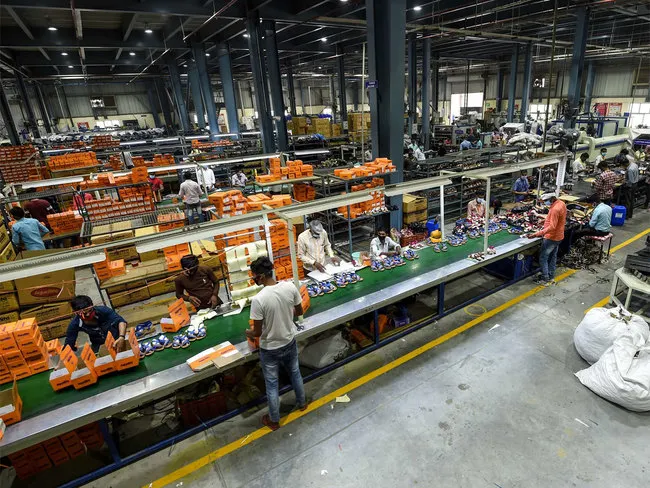

## What is Robotics?

Robotics, put simply, is the combination of electrical, software, and mechanical engineering to make tasks easier. But, the amount of robots being used in repetitive tasks in warehouses and factories is exponentially growing. This begs the question, will the rapid popularization of automation diminish the need for humans?

## Why do People do These Jobs?

Oftentimes, people are compelled to do these jobs due to their unfortunate economic conditions. Debt from school, high unemployment due to a desperate global economy, and low levels of education can all put people in these types of jobs. People need the money to survive and a spiraling concern is their ensuing replacement by machines.

## What Can Robots Currently Do?

Unfortunately, the general public only knows a fraction of the true potential of robotics. Some AIs create perfectly synthetic art from a single sentence description. Others make hyper-realistic human faces and write code for you just from a description! Some robots mow your lawn, weld entire car frames together, and even make Falcon 9 rockets that go to space. AIs have been used to design and manufacture the very airplanes you fly in. The advertisements we see are custom generated for each user using cookies and digital biometrics.

## The Light at the End of the Tunnel!

Despite the insane advancements in robotics, a technological revolution akin to this one has happened before. The industrial revolution, in particular, the advent of the steam engine sharply reduced the need for physical labor. The cotton gin and the mechanized loom left hundreds of thousands unemployed, and because of this people found new jobs to maintain the machines. In fact, this drastically increased the mean education level of people around the world.

## The Future Outlook

Despite the ominous clouds that hover over the future of AI and jobs, the grim attitude towards robotics research may be unnecessary. The next 50 years will be economically uninviting, the future of robotics will promote higher education, and innovation, and provide people with jobs that require human intelligence.
