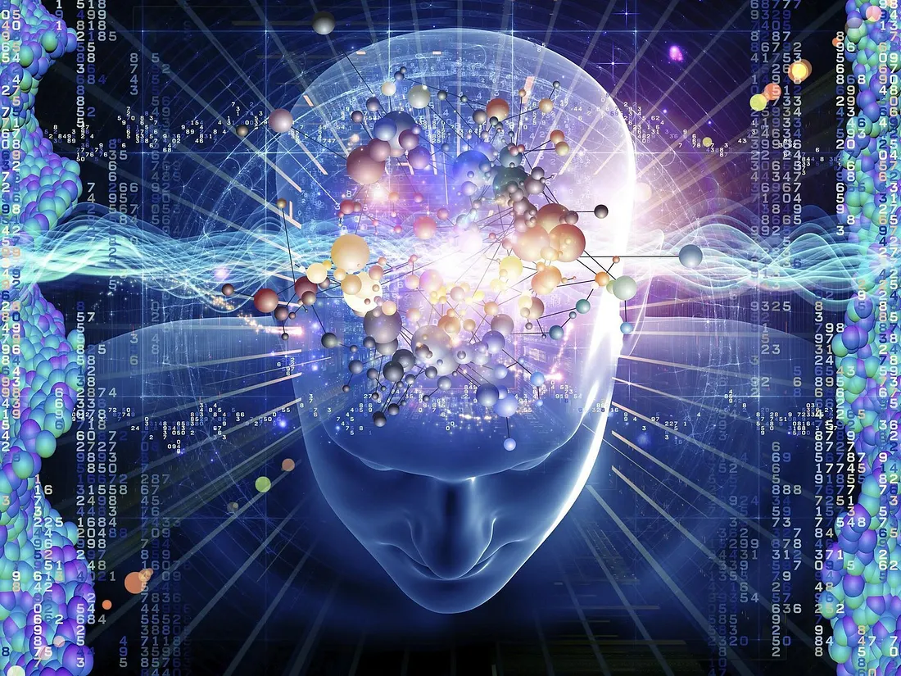
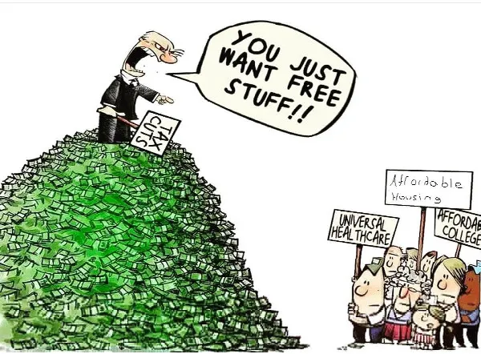
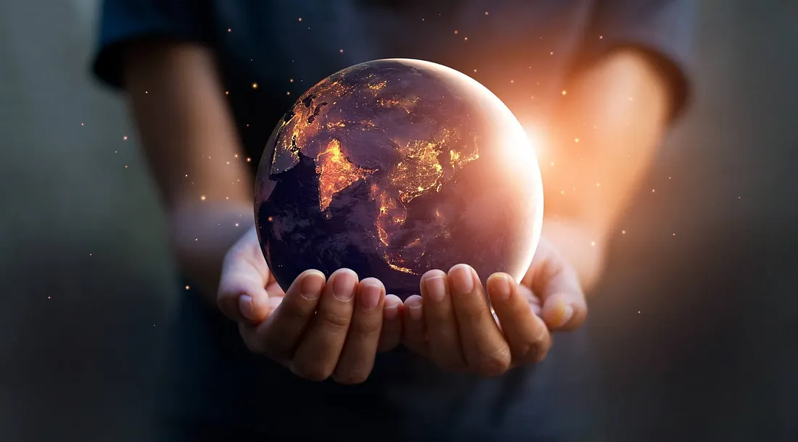

## It is not what you think…

We(specifically the *Homo* genus) have been on this beautiful planet for over 7000 millennia or 7 million years. For 95% of that time, we have intensively depended on our environment and local resources to thrive. Progress was slow, but so was the damage. We made tools out of rocks and sticks. A few million years later, we found brass, copper, iron, tin, etc., and life for all species on Earth was irreversibly altered. The avalanche was triggered on Everest, and even the most experienced mountain climbers can’t control it. Typically, these climbers would retreat to their base and allow the avalanche to pass, but their sheer confidence in their ability and self-proclaimed prowess in the mountains tells them to ignore the avalanche and reach the summit.

## What have we done?

It took decades to foresee but visionaries, like Stephen Hawking, understood the ignored consequences of our careless actions. Most people only see the first 2 feet of the mile-deep hole we drilled. Contrary to popular opinion, it isn’t simply about resource depletion or environmental damage. While those are significant components, it isn’t the complete story. In fact, the most important factor has been erased from your brain by contemporary politics! The human mentality has collectively deteriorated beyond repair.

--- 

**Please note**: This next section is not a critique of particular countries. Applying these accusations to a particular state or nation is your opinion and not our words.

---

## Reveal the truth…

Capitalism, greed, money, and power have become the primary purpose of human existence. Doctors take their oath to help people, only to purposefully reject some people of their service for money. Politicians make extravagant claims, only to sit on power and money once their position is confirmed. People bear arms and kill innocent civilians inexplicably. Businesses never think twice when selling private user information, violating their privacy policy, to earn money. In the history of our world, knowledge has never had a price. Today, it costs more money than a house to acquire an education worthy of any value in this judgmental world. While a nation’s sole responsibility is to protect its citizens, today, they are enchanted by powerful weapons and make people pay huge sums of taxes and bills for life necessities like insurance and education. Nations who fought to eliminate taxes from their imperialistic parent country, are now imposing massive taxes and ignoring the financially impaired!

We like to think that we are smart, but our actions prove otherwise.

## What can you do?

While these accusations were directed at countries and “more influential people”. This is, in fact, another pitfall of human mentality. Every person can make a difference, however, we choose not to. Speaking out about selfish actions, displaying kind human nature, and aiming to leave the world slightly better than you first saw it is the best thing you can do.

## Why does it matter? — Butterfly Effect

The butterfly effect is a branch of chaos theory aiming to show how an infinitesimal change in a deterministic state can result in drastic consequences in the future. Smiling and greeting a neighbor can prevent a murder! Publishing an article about the world can inspire others to rise and save our unrivaled blue planet.

