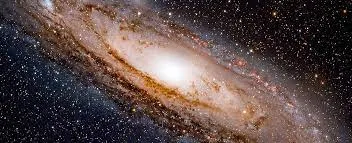

Knowledge is a goal, a goal impossible to reach. A goal scholar pursues their entire existence, knowing its unfeasibility. It is the peak of the highest mountain that mountaineers, weak and strong alike, climb, knowing their grave lies amidst the snow. It is a thought that intoxicates all who see its value and allows them to persevere through the climb to conquer more of the mountain and accept their ascertained defeat.

Knowledge is the pinnacle of thought and understanding of everything that is to be understood. Knowledge about the small atoms that work in unison to produce marvelous chemical machines, to the grand universe of unfathomable complexity. Knowledge about the predictable day after a long night to the stochasticity of the clouds encompassing our globe.

Knowledge is a key. A key that unlocks opportunity itself. From a simple job interview to the cure for cancer, it holds the very secret to things humans value most. A small, golden key in a world made of locks. Knowledge is key to every job, family, conversation, culture, achievement, and goal humans can think of, yet it remains a goal impossible to achieve.

Knowledge is a beacon that illuminates the path to all human desires. A beacon so bright as to irradiate outer space and the abyssal depths of the ocean. It is a tool that can show an enlightening path to peace and prosperity and the inhumane weapons of war. A beacon that — not only sheds light on the path ahead — but also illuminates the characteristics of the person holding the torch.

Although some might say that knowledge is attainable in a topic of smaller scope, to say that a subset of an infinite expanse of knowledge is finite would be to say that the human race has perfected certain fields, and nothing new can be obtained from them. A complete understanding of a certain field would require a complete understanding of knowledge itself since every component of this universe is linked — often in subtle ways.

Knowledge is a question as old as time itself. It materializes in many forms, from the inherent order in nature to “Cogito, ergo sum.” It is an existential question, unanswerable by even the greatest intellect. It is a question that trumps all questions in comparison, whose answer unlocks the very mysteries of nature itself.

While some think they have attained knowledge, and many more believe it is attainable in a human lifespan, we must consider the minuscule role we play in the infinite expanse of our universe.

