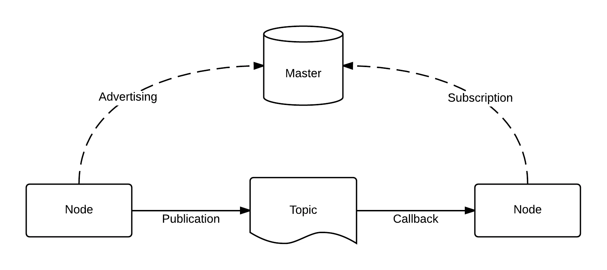

Alright, we have all heard of ROS, the Robot Operating System. But frankly, we don’t know what it is. Is it an OS? After all, it is in the name. Here is where the tricky part starts. Contrary to its name, it is just a software package that allows you to compile code-stacks, use 3rd party code-stacks, and apply these code-stacks to a peer-to-peer communication system for robotics. That was a lot so let me break this down.


## Take an Example!
You have a robot running some ARM device like a Raspberry Pi. It is a 3-wheeled robot and can’t do much complex processing. But you want to do some cool stuff like mapping and navigation. You want the robot to roam around and map the building. Once the map is ready, you want to tell the robot to go to the kitchen and it will follow.

This is a very complex problem to solve for a weak Raspberry Pi. But then, genius strikes! You also have a powerful PC with a GPU and all. What if the PC does all the hard stuff and sends all the results to the Pi? This is what ROS does(essentially).

### Important Note
What I am about to present from here on is strictly applicable to ROS1, not ROS2. ROS2 runs a more complex system that is drastically different from ROS1. I might make an article later for ROS2.


## What a standard ROS system looks like?

Let us start at the top and work down! At the top is the master. This is running the code to handle all the messages from the various nodes. But what are these nodes sending?

### Nodes 
So a Node is a big umbrella that can publish various topics, services, and actions. It could be the camera node that published images and can supply other info as a service. It can be any way you think you can logically organize your project.
### Topics 
Topics are what you think they are. They are names under which messages pass. The messages could be a String like, “Hi robot revolution!”, an Int like 42, or a custom one you made up like an image. For all we know, you can send any sort of data formats like arrays with images and strings, or a PointCloud, etc. These custom messages are made using .msg files. In it, you can specify the structure of your message and after compiling and a bit of coding, they can be used.
### Services 
A service is, well, a service. One node can request another node to do something based on data. I can give a node the numbers 2 and 3 and the node gives me back 5. Sorcery, I know! These work the same as messages in the way they are made. You would use a .srv file to make them.
### Actions 
You tell the robot to go forward. But then you forget! You can request the action node to return a status. Wait, the robot is about to fall off a cliff! You can also cancel the action. It is more complex than this but this is the basics.

Anyway, the master handles all the messages, services, and actions. A node is a community of code that contains topics, services, and actions. There are 2 things nodes can do.

### Publish
Publishers publish data and don’t care about the subscriber. For all we know, the publisher could be publishing data to an alien from Mars.

[https://www.utahpeoplespost.com/wp-content/uploads/2015/11/NASA-Announces-Big-Reveal-About-Mars.-What-Is-It.jpg](4.webp)

### Subscribe
[https://cdn.dribbble.com/users/5528375/screenshots/14069669/subscribe_animated_gif.gif](5.gif)
No not that subscribe. Subscribers subscribe to a publisher, hence start receiving the data being published. Again, the subscriber just knows the name of the publisher. The exchange is anonymous.

## ROS CLI
This is also a tricky part of ROS. There are several commands but here is how they work. You have a command for each of the main sections I talked about above.
```
roscore - to start Master server. 
rosnode - to help control ROS nodes
rostopic - to manage topics
rosservice - to manage services
rosaction - to manage action
rosrun - this is the command we use the most. It is to run your code once it is compiled.
```

You see how each of the commands is broken up into smaller sections based on different aspects of ROS. Note, that there are more commands than shown here. Each one of these commands has sub-commands. I will expand later in other parts on what they all do, but for now, know that you can read(echo) messages, run services and actions, measure the frequency and size of topics, and much more.

## RVIZ
RVIZ is a lifesaver for us mere mortals. Only the ROS Gods can live without it. It is a visualization tool where any sort of topic, message, or info coming in or out can be seen. PointClouds, odometry, images, video, numbers, and more. It can be run by simple typing “rviz” or “rosrun rviz rviz” but I will get into that later.

## What is a compiler?
We all know a compiler like g++ that takes C++ code and converts it to machine code that the computer better understands. Well, catkin(ROS compiler) is like g++ on steroids. It takes the code with some config information and compiles the entire node with respect to ROS libraries and other nodes. It can see the entire project and compile everything at once.

[https://media1.tenor.com/images/7eece0a4e5ecd2cb8b91a122d5d8efd1/tenor.gif?itemid=13161198](6.gif)

### Practice Question
Can you compile Python?

Answer: Yes!

Any programmer would say NO! But the magical catkin can! It compiles Python too. This way, ROS can use both Python and C++ together.

* I know the professional developers must be frowning down on me but this was a conceptual way to understand it. Don’t worry, I will explain later!
