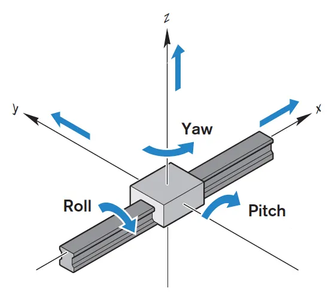

## Recap: What is a Topic

Remember from the [first part]() of this series, topics are a channel(a pipe), through which communication between nodes(sets of code) occurs. If you want to send sensor data from a microcontroller on a robot to another node on another machine(note how a machine can contain SEVERAL nodes), this would be the way to go.

Also, recall how a node can publish a topic and push data to it. Any other node on the network can anonymously subscribe to the topic and digest the information it can provide.

All good? Right then, let's get out hands dirty with some code and some errors as well!

---

## Format of this and future articles:

It is important to understand how this article will go. We will go through an example together. I believe that knowledge can only be attained through practical examples.

---

## Task 1
We have a gyroscope on the robot that is publishing data in this format:

```plaintext
Data:    135.6,    13.4,   3.14159
Format: FLOAT64  FLOAT64  FLOAT64
Axis:    roll      pitch    yaw
```

**NOTE**: The Format and Axis are NOT part of the data. They are just extra information I added.

### Data Formatting

We must first consider the format and structure of the data. This is not multidimensional data or a specialized format like an Image or Audio sample. This makes our life very easy.


Next, we must consider the amount of data and its relationship. The roll, pitch, and yaw axes correspond to each other so it is impractical to send them individually like this:

```plaintext
135.6
13.4
3.14159
```



ROS has the functionality to make a custom topic type that incorporates 3 `Float64` in a single message. But, that is way more complicated and beyond the scope of this article(there may be an article on this soon though).

We can also make this a comma-separated string. This way, we can send a single String message that contains the following information:

```plaintext
"135.6, 13.4, 3.14159"
```

The subscriber can then easily splice the string and extract their information. That won’t be too intensive and still maintain the time-dependent structure of the data.

## Programming

### Making the ROS Package
First, we have to make a ROS package which will be our node. That node will contain the code to make a topic and publish the message. There is a built-in command to do this using catkin.

First, though, navigate to the workspace:

```bash
cd catkin_ws/src
```

*NOTE*: You MUST be in src.

Then run this:

```bash
catkin_create_pkg basic_ros_topic std_msgs rospy roscpp --pkg_version 0.0.1 --description "Basic ROS Topic" --license MIT --author "Krishna" --maintainer "Krishna"
```

Yikes! That is a lot so let me break it down.

 * First, we have catkin_create_pkg which is the base command.
 * Next comes the name of the package, in this case basic_ros_topic . This can be anything.
 * Then, we add all the dependencies of the package. Here, we have 3: std_msgs rospy roscpp
  - stg_msgs is a ROS package that contains a bunch of data types like Float64, String, Int64, and more!
  - rospy is a library that contains methods for using ROS with Python. This is what we will use today.
  - roscpp is a library that contains methods for using ROS with C++. We will NOT use this today.
  - On a side note: ROS also supports Java, Lisp, and some other languages too!

Everything that is mandatory to install has been done. Now on to the optional stuff.

    These parts are really self-explanatory. It includes the license, description, author, maintainer, and version.
    You don’t need this but it is a good practice to keep.

Now, list the files in the directory. You will see this:
