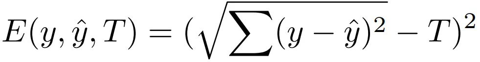
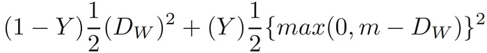

## Introduction

Chances are you have heard of a convolutional neural network (CNN). A network that revolves a kernel around an image to extract features and spatially interpret the image. These networks are some of the most prominent networks in the AI Industry, with applications in object detection, image processing, feature extraction, background removal, and image reconstruction and generation. With a minor but ingenious modification, these relatively primitive networks can be capable of an entirely novel niche of deep learning tasks enabling some powerful modern technologies like biometric authentication.

## What is the architecture of a Siamese Network?

The architecture of a Siamese Network consists of two convolutional neural networks that run in parallel on two different images. Furthermore, these two CNNs have identical weights and biases, allowing them to use similar extracted features to analyze differently.


We value two separate images, ground truth, and an “imposter”, with the same feature extractors and loss function to return an arbitrary similarity unit. To understand this concept further, it is imperative to understand the loss function governing the network.

### Loss Function

These networks typically use one of two loss functions: Contrastive Loss and Euclidean Loss.

**Euclidean Loss**


y = one of the CNN outputs

y_hat = the other CNN output

T = ground truth value (array of 1s or 0s)

This is the classic example of the “distance formula” applied to higher dimensions through matrices. We take a point in a high-dimension plane (i.e., the size of y and y_hat) and compute their Euclidean distance. This is a simple — but effective — technique to find the distance.

**Contrastive Loss**


D_w — Distance between points

Y — Truth value (0 = not related; 1 = related)

This loss function has two terms: one is responsible for rewarding the algorithm for having points closer together, while the other returns 0 if the points are farther out. This is made more apparent when the 1/2 normalization terms are removed.

## Implementation

With the theory out of the way, it is time for practical implementation. This implementation will be done in Tensorflow, but the PyTorch implementation should be similar in concept.

The first task is to import libraries and do the initial setup. My setup consists of a `Data` folder with subfolders for each of the categories.

```python3
import os
import pathlib
import random

import tensorflow as tf
print("TensorFlow version:", tf.__version__)
from tensorflow.keras.layers import Dense, Flatten, Conv2D

AUTOTUNE = tf.data.AUTOTUNE

dirs = os.listdir(str(pathlib.Path("Data").resolve()))

train_ds_arr = []

BATCH_SIZE = 32
```

Next, we need to create the class that will define the layers of the network and the forward pass.

```python3
class SiameseNet(tf.keras.models.Model):
    def __init__(self):
        super(SiameseNet, self).__init__()
        self.conv1 = Conv2D(64, 3, activation='relu')
        self.conv2 = Conv2D(32, 3, activation='relu')
        self.conv3 = Conv2D(64, 3, activation='relu')
        self.flatten = Flatten()
        self.d1 = Dense(128, activation='relu')
        self.d2 = Dense(64, activation='relu')
        self.d3 = Dense(32, )

    def call(self, x1, x2):
        # x1 = self.conv1(x1)
        # x1 = self.conv2(x1)
        x1 = self.conv3(x1)
        x1 = self.flatten(x1)
        x1 = self.d1(x1)
        x1 = self.d2(x1)
        x1 = self.d3(x1)

        # x2 = self.conv1(x2)
        # x2 = self.conv2(x2)
        x2 = self.conv3(x2)
        x2 = self.flatten(x2)
        x2 = self.d1(x2)
        x2 = self.d2(x2)
        x2 = self.d3(x2)
        return x1, x2
```

I have commented on the first two layers for computational simplicity (and image size limitations), but they can be used if needed. Additionally, the forward pass requires two arguments (namely `x1` and `x2`). This is because we use the same layers, thus the same weights and biases, in the forward pass of both images.

We can now make an object of the class and initialize the optimizer.

```python3
snn = SiameseNet()
optimizer = tf.keras.optimizers.Adam()
```

We must now create three functions to process the data and generate training batches.

```python3
def get_label(file_path):
    parts = tf.strings.split(file_path, os.path.sep)
    one_hot = parts[-2] == dirs
    return tf.argmax(one_hot)

def decode_img(img):
    img = tf.io.decode_jpeg(img, channels=3)
    return tf.image.resize(img, [170, 170])

def process_path(file_path):
    label = get_label(file_path)
    img = tf.io.read_file(file_path)
    img = decode_img(img)
    return img, label
```

The `get_label` function is responsible for using the file path to create an integer label for each category in the `Data` folder. The `decode_img` function is responsible for loading an image into TensorFlow and resizing it. Finally, the `process_path` function takes a given path, reads the file, decodes the image, and returns the modified image with its label.

Next, we must create TensorFlow datasets of the images for each directory and create a parent array to hold them.

```python3
for d in dirs:
    data_dir = pathlib.Path(os.path.join("Data", d)).with_suffix('')
    x = tf.data.Dataset.list_files(str(data_dir / '*'), shuffle=True)

    x = x.map(process_path, num_parallel_calls=AUTOTUNE)
    train_ds_arr.append(x)
```

Here, we map the listed files using out `process_path` function to create a dataset with images and labels.

We can now compile our model, set up metrics, and initialize callbacks.

```python3
train_loss = tf.keras.metrics.Mean(name='train_loss')

tb_callback = tf.keras.callbacks.TensorBoard("tensorboard")
tb_callback.set_model(snn)
```

Most importantly, we need to create a loss function I discussed earlier. For the sake of simplicity, I will use the Euclidean loss:

```python3
@tf.function
def euclidean(y1, y2, T):
    y1 = tf.convert_to_tensor(y1, dtype='float32')
    y2 = tf.convert_to_tensor(y2, dtype='float32')
    diff = tf.pow(tf.subtract(y1, y2), 2.0) 
    truth = tf.ones(diff.shape, dtype='float32') if T == 1 else tf.zeros(diff.shape, dtype='float32')
    return tf.pow(tf.sqrt(tf.tensordot(diff, truth, axes=len(diff.shape))), 2.0)

tf.config.run_functions_eagerly(euclidean)
```

Finally, add the training code.

```python3
@tf.function
def train():
    for _ in range(10):
        index1 = random.randint(0, len(train_ds_arr)-1)
        index2 = random.randint(0, len(train_ds_arr)-1)
        T = 0 if index1 == index2 else 1
        for (img1, label1), (img2, label2) in zip(train_ds_arr[index1].take(BATCH_SIZE), train_ds_arr[index2].take(BATCH_SIZE)):
            img1 = tf.expand_dims(img1, axis=0) / 255.0
            img2 = tf.expand_dims(img2, axis=0) / 255.0
            with tf.GradientTape() as tape:
                predictions = snn(img1, img2, training=True)
                loss = euclidean(predictions[0], predictions[1], T)

            gradients = tape.gradient(loss, snn.trainable_variables)
            optimizer.apply_gradients(zip(gradients, snn.trainable_variables))

            print(loss.numpy)
```
Here, we are randomly selecting a class from our master dataset array and — using a ternary — we compute whether the datasets are the same or different, which will be used as the truth value in the loss function. We select the batch and normalize the image values. Finally, we compute the forward pass and loss with `GradientTape`. The final lines compute the partial derivatives via automatic differentiation and apply these gradients to the optimizer.


## Conclusion

This shows just how simple and powerful Siamese Networks are. The networks are not just limited to images but can be applied to all forms of time-independent data that can be convolved. In fact, it is also possible to use Siamese networks without their convolutional component as simple Linear networks with a comparator (the loss function); however, it may function worse and is uncommon.
