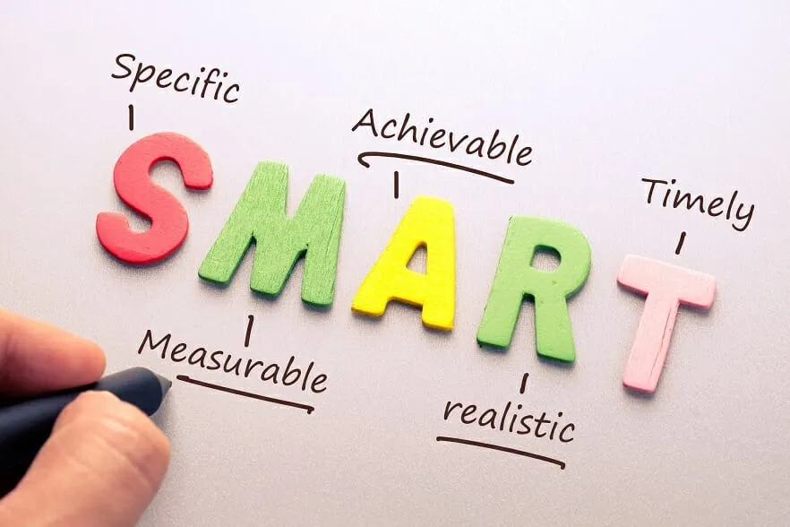
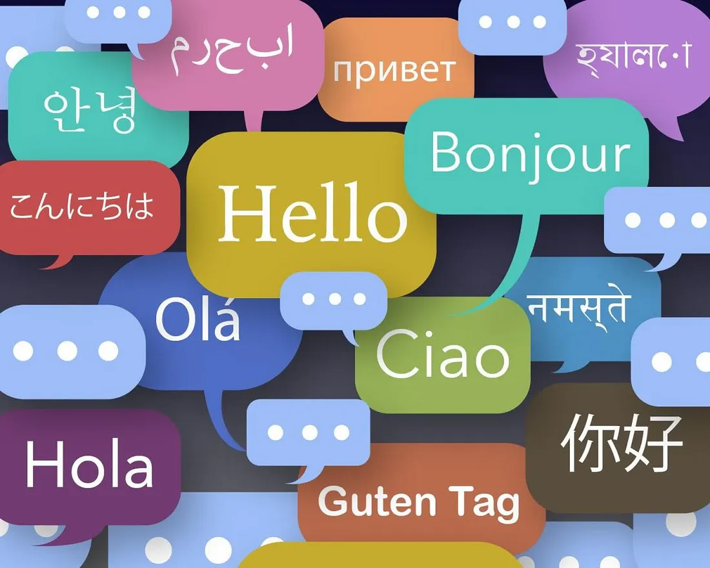

It is fair to say that humans are a dominating species on our blue planet. And certainly, the question must have crossed your mind at some point, “Why humans?” In retrospect, we make a mess wherever we go. The Great Garbage Patch, global warming, mass hunting and extinction, habitat loss, and there are several more. But that is not all! We savagely kill each other and fight for the most insignificant things. We are selfish, greedy, and vengeful. In fact, we eradicated several other species of humans like the Neanderthals.

## Intelligence

The standard argument that everyone convinces themselves with is, “We are smarter.” There are several flaws with this. What is smartness? If it is defined by multidimensional thinking, many animals like whales and dolphins beat us. This is because they have larger brains with more gyri(folds in the brain) that increase spatial thinking abilities.

Is it memory? Nope. Chimpanzees have a significantly better memory than us.

Is it language? Evidently not. Parrots can comprehend and retain languages extremely quickly. And wolves communicate and coordinate attacks in seamless precision. It can be compared to a special ops military attack.

A critic might propose that we are simply the culmination of all these animals and that is why we dominate. However, the octopus contains all the traits mentioned above.

### Octopii

Octopuses have the perfect proportion of memory, recognition, spatial thinking, pattern recognizing, agility, strength, etc. While we have roughly 60 protocadherins, octopuses have approximately 168! This means that they have 3 times the neural wiring capacity as us humans. Then why don’t we see octopuses making mansions and instruments and conducting mathematics?

## The Hard Truth

We humans have no idea. If octopuses desired, they could certainly advance to our level and challenge the human species. They have already done numerous feats like solving Rubik's cubes, solving other puzzles, and using mechanical advantage in their tools. They have all the resources we have on land, including minerals, chemicals, precious metals, and plastic bags(thanks to us). Then why do we see octopuses still using snail shells to protect themselves? Why haven’t octopuses created utopias and colonies underwater? Why can’t they make themselves a palace of coral and live in peace?

## The Difference

As enunciated previously, we are greedy. We don’t care about sustainability or the environment we depend on. We care about self-preservation and comfort. Maybe, the octopuses have realized the importance of nature. Octopuses have existed on Earth for 500 MILLION years as opposed to us, amateurs, who have existed for a mere 6 million years. Conceivably from their previous experience, they have understood the harsh lessons we are only now realizing. Perhaps they changed their lifestyle before it was too late.

## The Key Takeaway

We NEED to learn from the octopuses. We MUST let go of our ego and learn from these wise and experience creatures that have been on this planet for magnitudes more than us. And it is not just the octopuses, but every animal on Earth. Humans are unarguably the most unsustainable species on Earth contrasting with almost all other animals.

There are many animals that can challenge the human race if they wished. But, they have more sustainable practices and goals than us.

If octopuses went through the scientific, technological, and economic advancements that we are going through, it would be impossible to prove millions of years later. The dynamic ocean would have concealed the slightest traces of technology.

So, while we think that octopuses, chimpanzees, goats, etc. are just animals, there is a motive to consider why that is?

