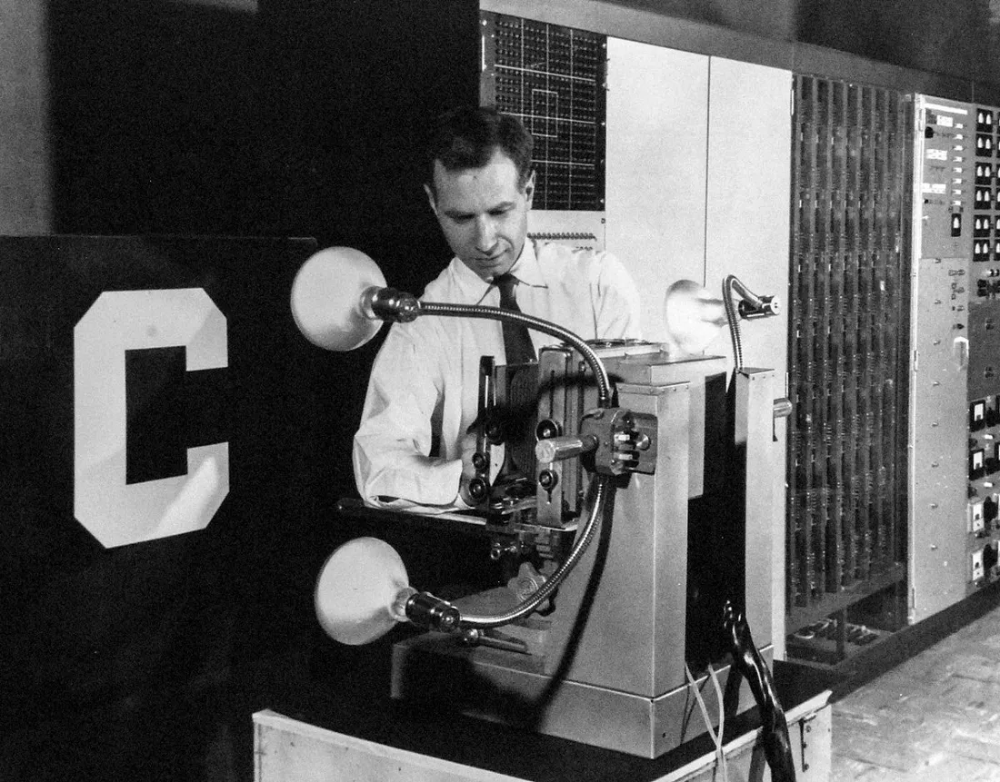
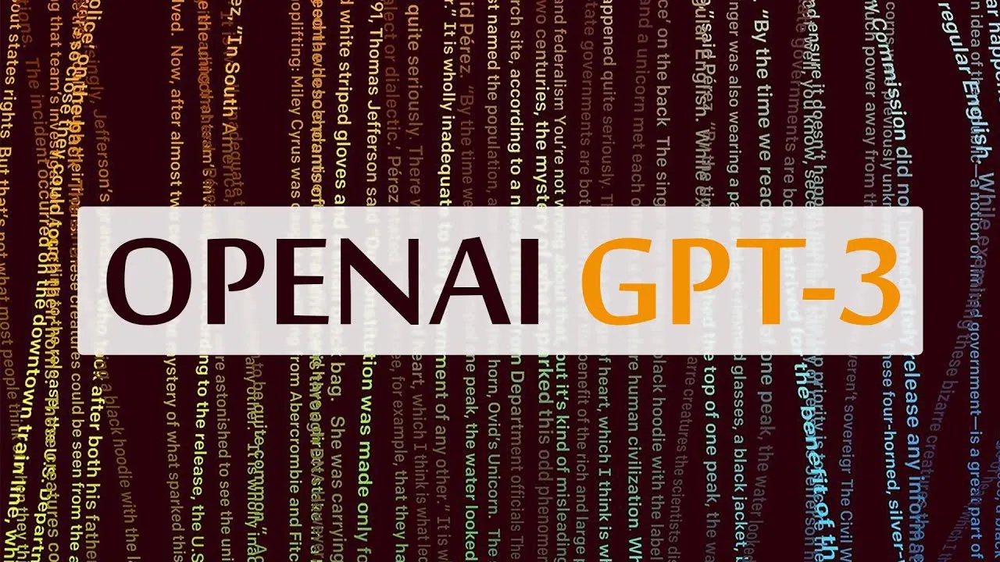

## The Premise

It was the year 1980, and all software engineers worldwide were excited at a new frontier of technology: Artificial Intelligence. The ability for the “Perceptron” to be fed a bunch of images and teach itself to recognize different simple objects was revolutionary. Visionaries foresaw the full future dominated by this intelligence. As computing power grew, promptly with the advent of parallel computing and dense silicon chips, so grew people’s ambitions. And, from these ambitions came the inevitable question: Is it possible for an AI to think, learn, and react like a living thing, even better, a human?

## The Concern

As novels and movies came out, concern spread like wildfire. People shunned the idea of thinking computers, fearing the ultimate demise of the human race. In the arms race for intelligence, there is no room for error. As this concern grew, these enthusiastic engineers left this idea as a hopeless venture for the future, when the public opinion isn’t as harsh. As foreseeable, the opinion faded away, as people focused on more prevalent issues to riot over.

## The Resurgence

With renewed confidence and contemporary technology to bolster such progress, new AI research companies emerged, namely Deepmind and OpenAI. These companies often partnered with then-emerging tech giants like Intel, Google, Microsoft, IBM, and Nvidia. Powerful feats were achieved to demark the prowess of modern ingenuity and sophistication in algorithmic mathematics and AI. This field of study was suddenly more accepted by the community and was permitted to grow. Institutions around the globe researched new ways to automate their labor-intensive tasks. Convolutions, GANs, Transformers, and Markov chains soon flooded the market with opportunities. It was as if the collective field of AI grew in intelligence. As AIs performed better, and more efficiently, they also became more accessible. Companies incorporated these models in their advertisements, user management systems, and more.

## Modern AI

With the release of OpenAI’s GPT3 and the new almighty Deepmind Gato, people started claiming the invention of General Intelligence. People believe that General Intelligence is when an AI can do several, seemingly unrelated tasks, independently. Just because GPT3 can write code, draw pictures, and write completely original stories doesn’t mean that it is approaching the intelligence of a human being. Quite the contrary actually!

## What is General Intelligence?

Throughout the years, there are several non-intuitive definitions made. True general intelligence is the ability of a machine to automatically acquire and train itself on a vast variety of knowledge that it may acquire from any source. It must also be able to make new predictions on the data upon inquisition (direct or indirect). This machine may not start with any pre-trained models, data, etc. OpenAI and Deepmind have made incredible progress and their feats are irrefutable evidence of innovation. But, they were trained on carefully procured data made by humans. This is what disqualifies it from the most comprehensive and logical definition of General Intelligence.

